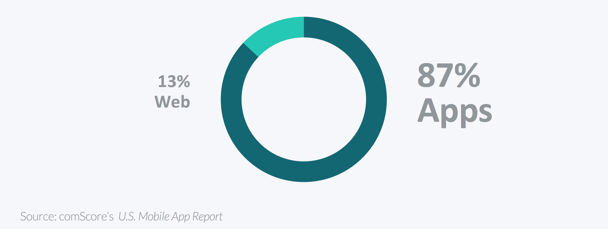
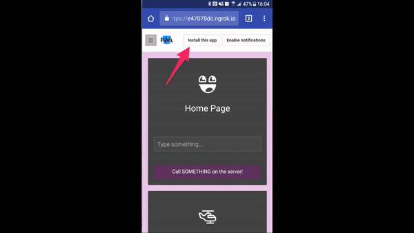
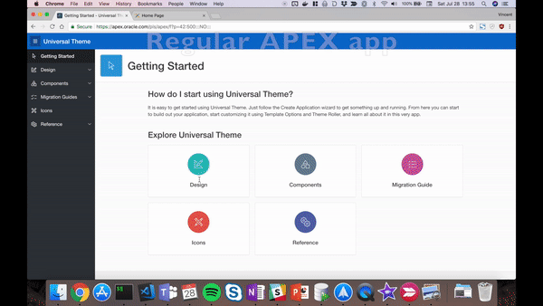
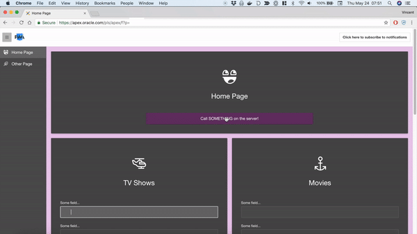

# Part 1: Introducing PWA

> This blog post series intends to cover everything there is to know about turning an APEX application into a Progressive Web App.
>
> This documentation is also available [on my blog](https://vmorneau.me/apex-pwa-part1).

## APEX as a PWA: The Complete Guide

* **Part 1: Introducing PWA**
* [Part 2: Setup and Development Tips](./doc/part2.md)
* [Part 3: JavaScript Recap](./doc/part3.md)
* [Part 4: Installing an APEX App into a Mobile Device](./doc/part4.md)
* [Part 5: Using an APEX App Offline](./doc/part5.md)
* [Part 6: Handling Background Sync](./doc/part6.md)
* [Part 7: Sending Push Notifications](./doc/part7.md)
* [Part 8: Final Thoughts](./doc/part8.md)

## Part 1: Table of Content

* [What is a PWA](#what-is-a-pwa)
* [Native App Benefits](#native-app-benefits)
* [Statistics](#statistics)
* [PWA Concepts](#pwa-concepts)
* [Goals of a PWA](#goals-of-a-pwa)

---

## What is a PWA

Let’s establish something clear right from the start: PWA stands for Progressive Web App and it refers to a bucket of concepts, aiming to close the gaps between traditional web apps and native apps.

PWA are not about _one_ technology, they're about a set of modern browser APIs that, put together, make the case for a very compelling web user experience that resembles a native app.

I've always been a web developer. I love the openness of the web and the freedom it gives. I love the standards of the languages it uses. I love the fact that web apps can be released without involving users via system updates. I love that web apps don't need a special license to develop on a platform.

I don’t like having to learn multiple languages to publish the same app on iOs and Android. I don't like that we have to go through approval to release a new version of a native app.

But there is no denial that native apps have clear benefits over web apps.

## Native App Benefits

Virtually everyone prefers a native app over a web app and there are good reasons for that.

Native apps are installable on a mobile device through an app store, which generates an icon on the home screen for easier accessibility. This app launches in full screen and is not cluttered with a URL bar. It scales responsively regardless of the screen size.

A native app can still work offline by offering partial functionality and will synchronize pending requests with the server when the connectivity comes back.

Until now, browser based apps weren't able to do that.

## Statistics

Statistics don't lie. 87% of data consumption comes from native apps, leaving only 13% coming from web apps.

To me this is misleading because the market is dominated by the likes of Google, Facebook, Twitter, Microsoft, Apple, etc. Of course people will be pulling more bandwidth from these giants than from my APEX application.

But as an Oracle developer, I look at the chart above and I can't help but think there must be something going on there. I develop web apps using APEX, so what is it I'm missing?

## PWA Concepts

Learning to turn APEX into a PWA is the equivalent of learning a small number of modern browser APIs. These APIs will allow your APEX application to match a native app experience.

Making a PWA doesn’t require the use of external or 3rd party libraries. In other words, ==everything in this guide is pure JavaScript and pure APEX.==

Here are the concepts I will be covering in this guide:

### App Manifest

An app manifest is a file containing the configuration that allows for a web app to be installed on a device. In most cases PWA tend to be installed on mobile devices, but the app manifest also allows for installing a web app into a desktop (Mac, Windows, Linux).

We will reference the app manifest within APEX, so the app can be installed at any time when the user is browsing.

[Part 4](./part4.md) of this guide explains how to install APEX on any device.

### Service Workers

A service worker is JavaScript code that lives in the background of an app, listening to events like fetching a resource or receiving a notification, meaning that a service worker can still operate even when the browser is closed or when the phone is off.

A service worker is the mastermind at the center of the PWA concepts. It's the code that links everything together for a seamless native app experience. In this guide, our service worker will be leverage the following browser APIs.

#### Cache API

The way we are going to allow offline usage is by caching the app shell. The app shell is what constitutes the user interface. By caching the app shell, the APEX app should load much faster since we don't need to hit the server for every page request.

The browser provides a Cache API for storing resources. In the context of an APEX application, our app shell are going to be APEX pages, along with the necessary JavaScript, CSS and other files to allow browsing while offline.

[Part 5](./part5.md) of this guide explains how to enable offline usage of an APEX application.

#### Sync API

It's one thing to enable offline usage to a web app, but the true power comes when you can continue using the features of your app while being offline. The sync API will synchronize pending requests when the signal comes back. This synchronization method covers client-to-server and server-to-client.

[Part 6](./part6.md) of this guide explains how to properly synchronize data when toggling between offline mode and online mode.

### Notification API

Browsers come with an API that allows us to handle push notifications. A push notification can be received at any time, whether the user is browsing the app or not. The mobile device can be sleeping in a user's pocket and still received a web push notification.

The notification API makes it possible to display the notification, add custom icons and vibration patterns. It handles what to do when clicking on a notification, or dismissing a notification.

In the context of APEX, a notification can be sent to all users of the app, or a group of users, or even a single user.

[Part 6](./part6.md) of this guide explains how to setup and use push notifications in APEX.

### Other PWA Concepts

A complete PWA covers more, but this guide will not cover the following concepts, because I think those topics can be better learned elsewhere.

* **Responsive UI**: Accomplished using [Universal Theme](https://apex.oracle.com/pls/apex/f?p=42).
* **Served via HTTPS**: Necessary for a PWA. Dimitri Gielis has a great [blog post](http://dgielis.blogspot.com/2016/05/please-use-https-for-your-apex-apps.html) on that topic.

## Goals of a PWA

The next parts in this guide will cover implementation details with rich code snippets for each PWA concept, but first it's important to understand why we're doing this.

1. **A PWA is more reliable.**

   While doing research for this guide, I came across [a discussion on LinkedIn's official APEX group](https://www.linkedin.com/groups/8263065/8263065-6404937118157717506). The APEX application needed to be usable on off-grid farms. Data entry has to be taken with APEX locally on a mobile device and then synchronized back to server when connectivity comes back. A web app that is only usable on a stable connection is not reliable for all use cases.

   Another common use case is being on intermittent network, like using an application on the subway. We might loose the signal for a minute or two, and it becomes very convenient if we are not interrupted. A PWA allows that kind of reliability.

2. **A PWA is faster than a traditional web app**

   By leveraging the Cache API, PWA can serve cached resources (APEX Pages) to the user, which is much faster than reaching to the server. When a user requests a resource that isn't cached already, the PWA will reach for the server and then cache the resource for later.

   That is particularly easy for static resources such as HTML, JavaScript, CSS and images which constitute an APEX page, but also for data.

3. **A PWA is more engaging**

   It will always be more convenient to reach for an icon on the home screen rather than bookmarking a URL. By having an APEX app explicitly sitting on a mobile device home screen, the user engagement level is significantly increased.

   More importantly, users need to be reminded to go back to their application to complete things. Email or SMS are not ideal in most cases. Push notifications are simple reminders that can be dismissed easily, which makes them the perfect candidate to increase user engagement.

---

Hopefully that cleared out the WHAT and the WHY around PWA. Now let's head to the [Pre-requisites and APEX Setup](./part2.md) section, where we will establish the groundwork for the PWA code architecture.

_Think this documentation can be enhanced? Please open a pull request and fix it!_
