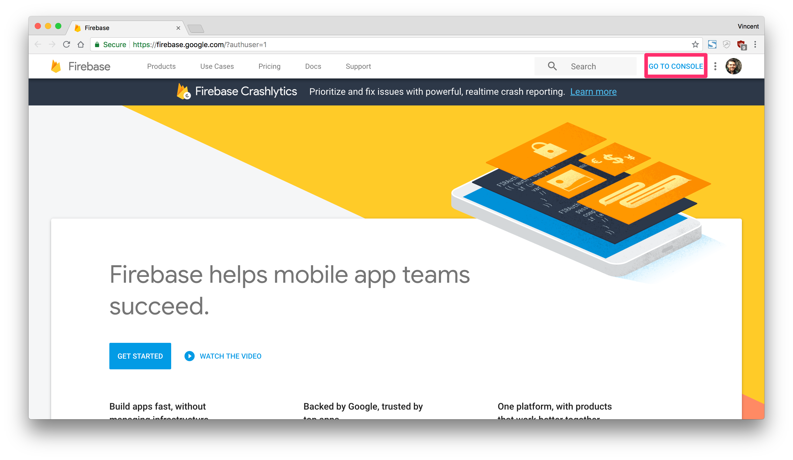
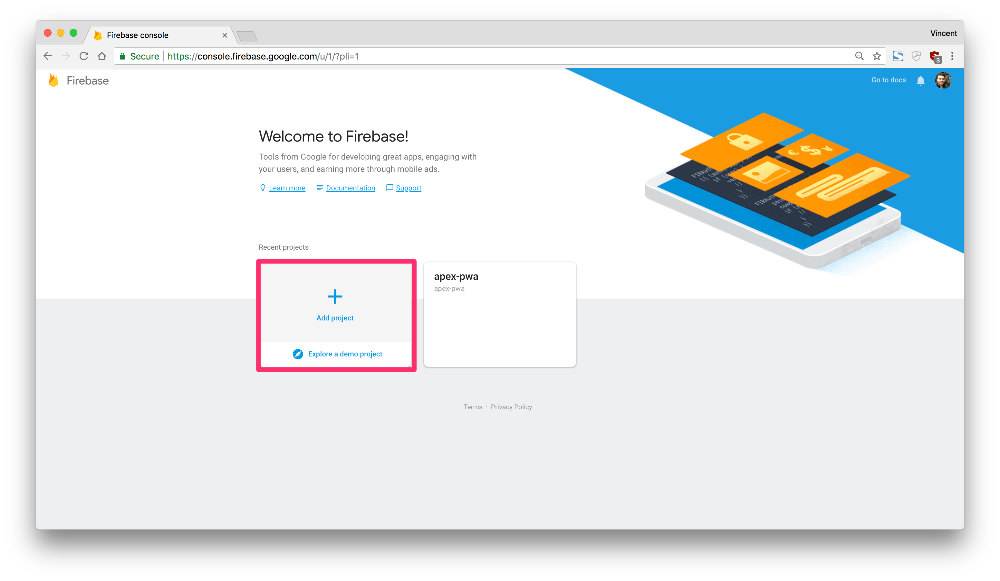
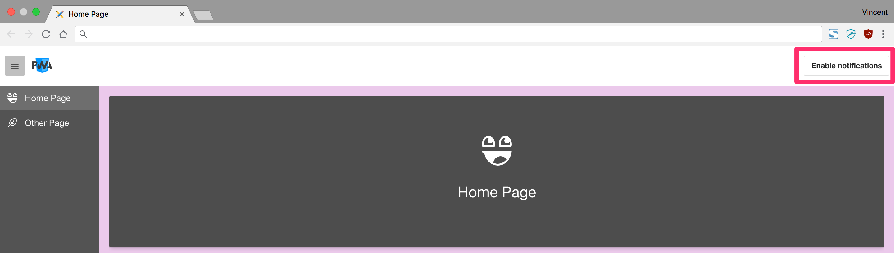
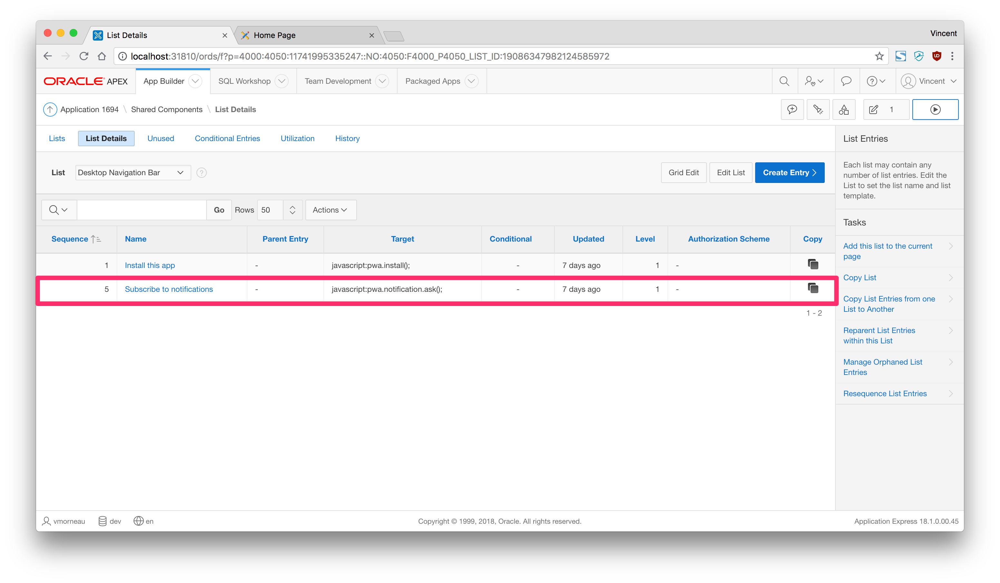
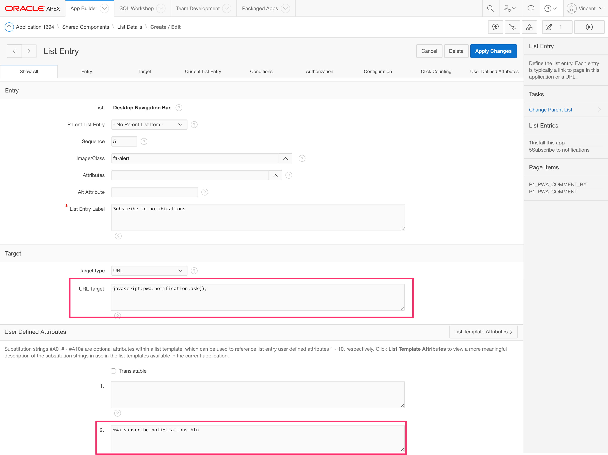
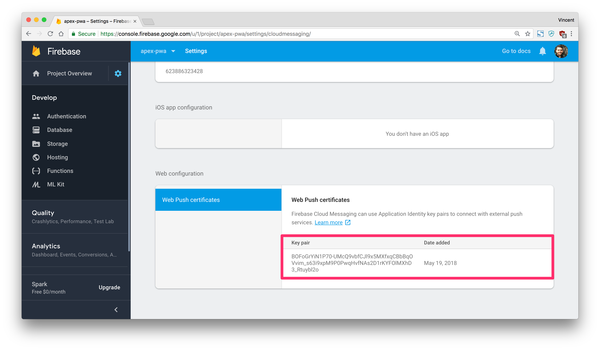
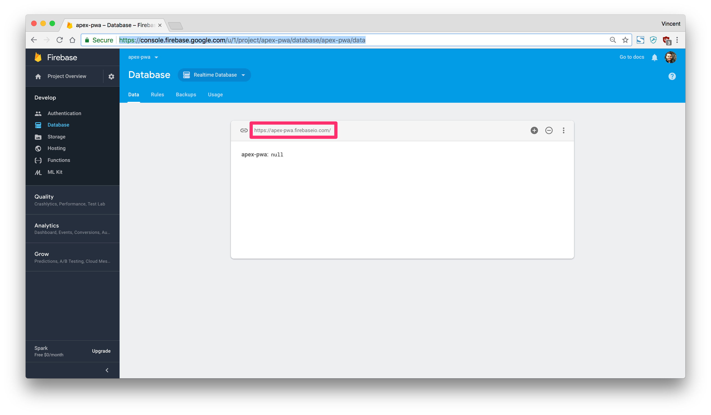
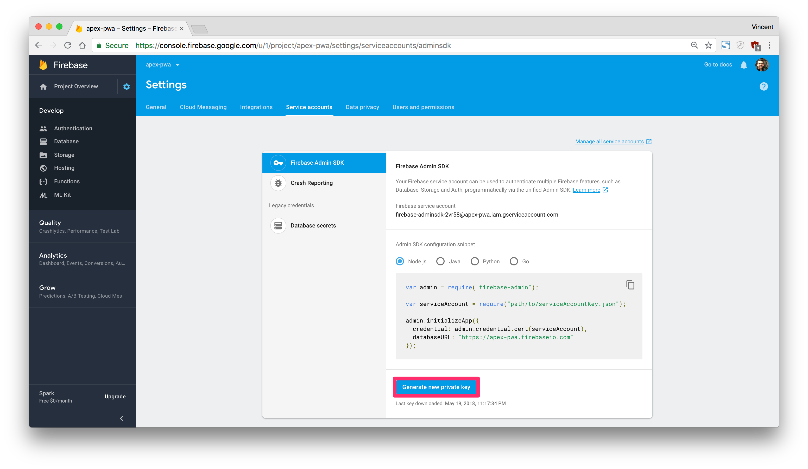
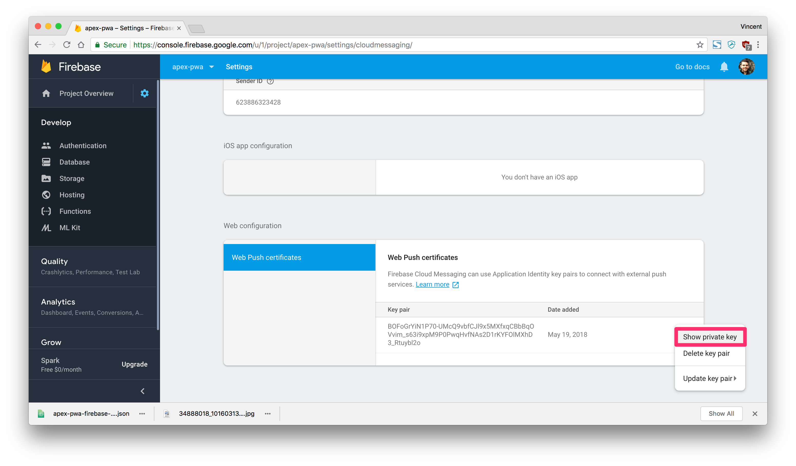

# Part 7: Sending Push Notifications

> This blog post series intends to cover everything there is to know about turning an APEX application into a Progressive Web App.
>
> This documentation is also available [on my blog](https://vmorneau.me/apex-pwa-part7).

## APEX as a PWA: The Complete Guide

* [Part 1: Introducing PWA](./doc/part1.md)
* [Part 2: Setup and Development Tips](./doc/part2.md)
* [Part 3: JavaScript Recap](./doc/part3.md)
* [Part 4: Installing an APEX App into a Mobile Device](./doc/part4.md)
* [Part 5: Using an APEX App Offline](./doc/part5.md)
* [Part 6: Handling Background Sync](./doc/part6.md)
* **Part 7: Sending Push Notifications**
* [Part 8: Final Thoughts](./doc/part8.md)

## Part 7: Table of Content

* [Characteristics](#characteristics)

---

## Characteristics

Push notifications are probably my favorite PWA feature. They offer great value to the user experience and they are relatively easy to implement.

We are so used to push notifications on our native mobile apps that it has a natural feeling, but at the same time it feels fresh and innovative coming from an APEX application.

The implementation we'll cover here is part PL/SQL and part JavaScript.

Preview:


Observations:

* User is closing an application on a mobile device, so the app is only running in the background
* Executing a PL/SQL anonymous block in SQL Developer, which makes a REST call
* Behind the scenes, the REST process activates a push notification
* Mobile device receives the push notification

## Firebase

Before we do any coding, we'll have to register to Firebase which is a service from Google. Firebase is the central point from where notifications are sent to all subscribed mobile devices. Firebase is also the solution that [Oracle recommends](https://docs.oracle.com/cloud/latest/marketingcs_gs/OMCFA/) for sending push notifications in general.

When you have [created your account on Firebase](https://firebase.google.com/), head to your console:



From there, you can create a new project, which we will use in our APEX application later:



## Registering to Push Notifications

Push notifications need to be activated by the user to prevent from spamming anyone. So first, we will add a new button in the navigation bar of our application to request the permission for notifications:



Here's the button on the navigation bar list:



Here's the button details:



The button invokes `pwa.notification.ask();`, which we will define after we link it to Firebase. First, in `app.js` we will define a few global variables to initialize the connection to Firebase.

```javascript
/* === #APP_IMAGES#js/app.js === */

// Public key from Firebase
// CHANGE THIS VALUE TO YOUR FIREBASE PUBLIC KEY
var firebaseVapidPublicKey = 'BOFoGrYiN1P70-UMcQ9vbfCJl9x5MXfxqCBbBqOVvim_s63i9xpM9P0PwqHvfNAs2D1rKYFOlMXhD3_Rtuybl2o';
```

The `firebaseVapidPublicKey` can be found here on your Firebase account:



```javascript
/* === #APP_IMAGES#js/app.js === */

// REST endpoint where we store requests for push notifications
// CHANGE THIS VALUE TO YOUR FIREBASE DATABASE
var firebaseNotificationEndpoint = 'https: //apex-pwa.firebaseio.com/notifications.json';
```

The `firebaseNotificationEndpoint` can be found here on your Firebase account (make sure to add `/notifications.json` at the end):



Then here is the `pwa.notification.ask();` code:

```javascript
/* === #APP_IMAGES#js/app.js === */

pwa.notification = {
  /**
   * @function ask
   * @example pwa.notification.ask();
   * Requests the permission to allow notifications
   **/
  ask: function () {
    // Request permission to subscribe to notifications
    Notification.requestPermission(function (result) { // (1)
      if (result === 'granted') {
        console.log('Notification permission granted!');

        // Subscribe to the notification
        apexServiceWorker.pushManager.subscribe({ // (2)
            userVisibleOnly: true,
            applicationServerKey: urlBase64ToUint8Array(firebaseVapidPublicKey)
          })
          .then(function (notification) {
            // POST the notification subscription to Firebase
            // notification.json below could be anything
            return fetch(firebaseNotificationEndpoint, { // (3)
              method: 'POST',
              headers: {
                'Content-Type': 'application/json'
              },
              body: JSON.stringify(notification)
            });
          })
          .then(function (res) {
            if (res.ok) {
              // Show the first notification (4)
              apexServiceWorker.showNotification('Successfully subscribed!', {
                body: 'You have successfully subscribed to our APEX notification service.',
                icon: appImages + 'images/icons/icon-96x96.png',
                badge: appImages + 'images/icons/icon-96x96.png'
              });
            }
          })
          .catch(function (err) {
            console.error('Subscribing to notifications failed.', err);
          });
      } else {
        console.warn('Notification permission denied.');
      }
    });
  }
};
```

Observations:

1. This opens a confirmation windows to ask for the permission to send push notification
2. The push notification requests gets saved in the service worker
3. Sending the push notification request to Firebase using your public key and your database
4. Send a first notification mentioning that the service is working properly

## Sending a Push Notification

After a user has subscribed to notification, he can finally received push notifications. In the context of an APEX application, we most likely want to send notification after a database event occurs (for example a new row inserted in a table). Here is a simple PL/SQL anonymous block that would fire the push notifications to all subscribed users:

```sql
declare
  l_rest_return clob;
begin
  l_rest_return := apex_web_service.make_rest_request(
    p_url => 'https://localhost:3050/push' -- My custom REST endpoint (1)
    , p_http_method => 'GET'
    , p_parm_name => apex_util.string_to_table('title:body') -- Notification structure (2)
    , p_parm_value => apex_util.string_to_table('Hey you:Go back to APEX now!') -- Notification Content (3)
  );
end;
```

Observations:

1. Calling a REST endpoint to communicate with Firebase. More on this later.
2. These are the structure of the push notification. `title` and `body` are the minimum required properties.
3. These are the values forming the push notification. These can be anything.

If we extrapolate this methodology, we can use this in **any** part of our back end code; in a trigger, in a package or anywhere. Again, from an Oracle perspective, that becomes extremely powerful.

## Setting up the REST Endpoint

Firebase offers a few ways to communicate, but the easiest one is with Node.js. We will build the REST endpoint to communicate with Firebase, which the PL/SQL anonymous block is invoking above. The following code is provided in this GitHub repository, but there are a few values to substitute for the benefit of your own application. First we will include the dependencies:

```javascript
/* === ~server/pushNotification.js === */

var admin = require('firebase-admin');
var webpush = require('web-push');
var express = require('express');
var bodyParser = require('body-parser');
var app = express();
```

Then we need a global variable to reference a file for connecting to your Firebase account:

```javascript
/* === ~server/pushNotification.js === */

// CHANGE_ME_1
// THE FOLLOWING FILE REFERENCE IS YOUR FIREBASE SERVICE ACCOUNT FILE
var serviceAccount = require('./firebase.json');
```

You can get your service account JSON file (`firebase.json`, to be renamed) in your Firebase project dashboard and store it in the `~/server/` folder from here:



Then we want to initialize the web push library using our Firebase public and private keys:

```javascript
/* === ~server/pushNotification.js === */

// CHANGE_ME_2
// CHANGE THE FOLLOWING WITH YOUR EMAIL, PUBLIC KEY AND PRIVATE KEY
webpush.setVapidDetails(
  'mailto:vincent.morneau@gmail.com',
  'BOFoGrYiN1P70-UMcQ9vbfCJl9x5MXfxqCBbBqOVvim_s63i9xpM9P0PwqHvfNAs2D1rKYFOlMXhD3_Rtuybl2o',
  '2yztumiibMCOxZtKny2l4lZ-pXj01151vlV5BcWJDmY'
);
```

These bits of information can be found on your Firebase Cloud Messaging tab:




We also want to initialize the Firebase server using our Firebase database URL:

```javascript
/* === ~server/pushNotification.js === */

// CHANGE_ME_3
// THE FOLLOWING WITH YOUR FIREBASE DATABASE URL
admin.initializeApp({
  credential: admin.credential.cert(serviceAccount),
  databaseURL: 'https://apex-pwa.firebaseio.com/'
});
```

The database URL can be found under your Firebase database tab:


At last, here's the rest of the generic code for our push notification server:

```javascript
/* === ~server/pushNotification.js === */

app.use(bodyParser.json());
app.use(bodyParser.urlencoded({
  extended: true
}));

// REST endpoint for sending push notifications
app.get('/push', function(req, res) {
  // Get the 'notifications' module from Firebase
  admin.database().ref('notifications').once('value')
    .then(function(subscriptions) {
      // Iterate through all subscriptions
      subscriptions.forEach(function(subscription) {
        // Get the end point and keys for each subscription
        var pushConfig = {
          endpoint: subscription.val().endpoint,
          keys: {
            auth: subscription.val().keys.auth,
            p256dh: subscription.val().keys.p256dh
          }
        };

        // Send a push notification for this subscription
        webpush.sendNotification(pushConfig, JSON.stringify({
            title: req.query.title,
            body: req.query.body,
            icon: req.query.icon,
            badge: req.query.badge
          }))
          .then(function() {
            res.status(200).send({
              message: 'Notifications where sent successfully'
            });
          })
          .catch(function(err) {
            res.status(500).json({
              message: 'Notifications failed',
              error: err
            });
          });
      });
    })
    .catch(function(err) {
      console.log(err);
    });
});

// CHANGE THE PORT BELOW (OPTIONAL)
var server = app.listen(3050, function() {
  console.log("APEX PWA Push Notification Server Running on Port", server.address().port);
});
```

Steps for running this server:

* Edit `pushNotification.js` and replace with your Firebase account information where indicated
* Open a terminal
* `cd` into the `~/server/` directory
* Execute `npm install`
* Execute `node pushNotification.js`

Then the push notification server will be running on port 3050, which hosts the REST endpoint that we are calling in PL/SQL.

## Receiving a Push Notification

In the previous steps, we have seen how to send a push notification to all subscribed users. Now we will see how to receive a push notification and display it on the device.

As explained previously, the service worker is a JavaScript file that runs code in the background, so it is the perfect candidate to listen for incoming push notifications and do something with it. Back to our service worker file, we will add a new event:

```javascript
/* === ~/sw.js === */

self.addEventListener('push', event => {
  console.log('[SW] Push Received.', event);
  event.waitUntil(pushSW(event));
});

/**
 * @function pushSW
 * Received a notification and shows it to the user
 **/
async function pushSW(event) {
  // Parse the notification received as a JSON object
  notification = JSON.parse(event.data.text()); // (1)

  // Show the notification
  self.registration.showNotification( // (2)
    notification.title, { // (3)
      body: notification.body, // (4)
      icon: './images/icons/icon-192x192.png',
      badge: './images/icons/icon-192x192.png'
    }
  );
}
```

Observations:

1. The service worker receives an object (`event`) that contains the content of the notification and we are parsing that object as JSON
2. The service worker is leveraging the `Notification` API to send a push notification to the user
3. The title object comes from the PL/SQL anonymous block (see above)
4. The body object comes from the PL/SQL anonymous block (see above)

The bottom line is: we’ve sent a notification request from SQL developer to our custom REST endpoint, which funnels the request to Firebase, which broadcasts the push notification to all registered devices who are listening with their service workers.

## Push Notification Events

After we have received a notification, we might want to handle the actions that a user makes on them. The service worker allows to handle clicking on a notification and closing a notification. Here's how we would do it:

```javascript
/* === ~/sw.js === */

self.addEventListener('notificationclick', event => {
  console.log('[SW] Notification clicked', event);
});

self.addEventListener('notificationclose', event => {
  console.log('[SW] Notification closed', event);
});
```

These events are useful for controlling getting back into the application.

---

With push notifications going, we covered the last feature of our PWA guide. Here's a small piece on my [Final Thoughts](./doc/part8.md) regarding PWA in APEX.

_Think this documentation can be enhanced? Please open a pull request and fix it!_
